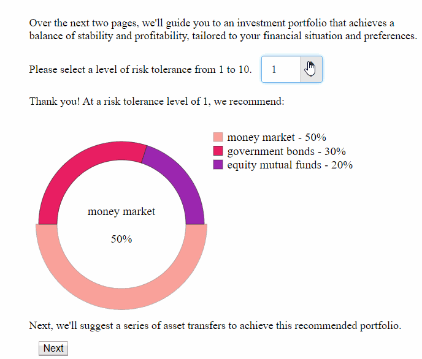

The live demo is [here](https://robs-other-acct.github.io/donut-chart/).

## Comments: 

### Display widgets

The first widget is NumberPicker from [this](http://jquense.github.io/react-widgets/api/NumberPicker/) library. I think it looks nice, and it gives the user the option of typing or clicking (which makes sense here since 10 is a manageable number to 'spin' through, given the fast rate of spin). T

The donut chart is edited from [this source](https://www.npmjs.com/package/react-donut-chart). The main edit I made was to place the legend vertically above the donut in mobile view.

The 'monetary inputs' on page 2 were built from ordinary html inputs. The idea is to display the monetary form when the input is not active (i.e., in 'focus'), but simplify to just a number when the user is editing the value in the input.

The widget on page 2 of the app is built from scratch, and could still use some adjustments when it comes to mobile view, particularly when the user has more than two choices.

### The algorithm

I spent a good chunk of time playing with the idea of reducing the number of transactions the user makes between their asset types (towards achieving a given investment portfolio). After entering his or her current portfolio, the user is presented with various options, each option being a set of transactions, such that the resulting margin of error is not more than a few percentage points for each asset type. In some cases this restriction (of small error) results in no extra options being given to the user, but this is rare if the user owns several asset types. 

### Time spent

Widget displays: 6 hours

Original algorithm: 1 hour

Extended algorithm: 6 hours

